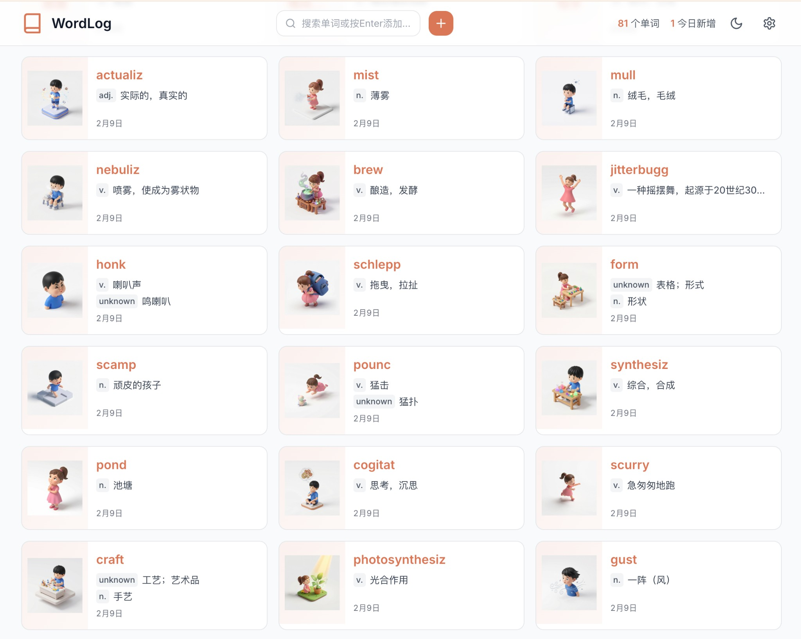
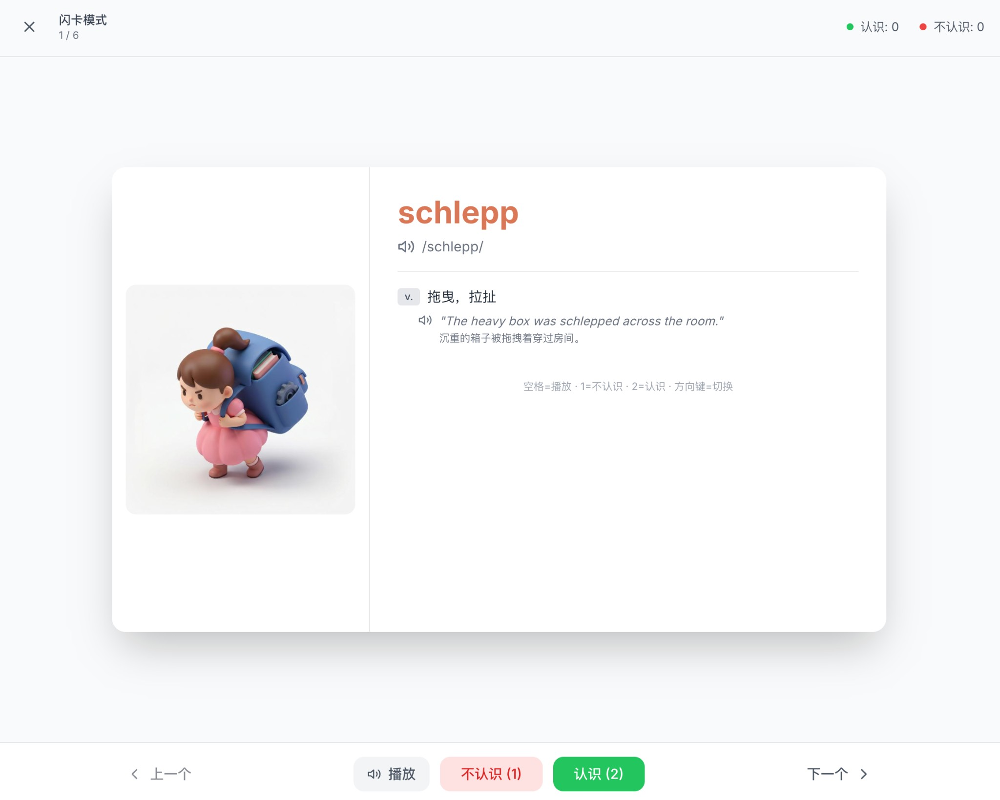

# WordLog

> 单词收藏助手 - Chrome 插件 + Web 应用

[](./CHANGELOG.md)
[](LICENSE)

## 📸 界面预览

| 单词列表 | 单词详情 | 闪卡模式 |
|---------|---------|---------|
|  |  |  |

## 🎯 简介

WordLog 是一个简洁实用的单词收藏工具，帮助你快速收藏和学习英语单词。

- **Chrome 插件**: 浏览时快速添加单词
- **Web 应用**: 完整的单词管理功能
- **智能识别**: 自动识别单词时态（ran → run）
- **发音朗读**: Web Speech API 语音朗读

## 🚀 快速开始

```bash
# Web 应用
cd web-app
npm install
npm run dev
# 访问 http://localhost:3001

# Chrome 插件
# 1. 打开 chrome://extensions/
# 2. 启用"开发者模式"
# 3. 加载已解压的扩展程序，选择 chrome-extension 文件夹
```

详细使用说明请查看 [📘 QUICKSTART.md](./QUICKSTART.md)

## 📂 项目结构

```
WordLog-WebApp/
├── chrome-extension/    # Chrome 插件
├── web-app/             # React Web 应用
├── docs/                # 界面截图等文档资源
├── CHANGELOG.md         # 更新日志
├── QUICKSTART.md        # 快速开始指南
└── README.md            # 本文件
```

## ✨ 核心功能

### Web 应用
- 🔍 智能搜索（搜不到自动添加，已存在自动置顶）
- 📝 单词时态识别（100+ 不规则动词）
- 🎯 时态形式展示（过去式、分词等）
- 🔊 语音朗读（单词、例句、时态形式）
- 📊 统计数据（总单词、今日新增）
- 📤 导出功能（TXT、CSV、MD）

### Chrome 插件
- ⚡ 快速添加单词
- 🔄 自动转换为原形（ran → run）
- 📋 最近5个单词展示
- 🔗 打开完整版按钮

## 🛠️ 技术栈

### Chrome 插件
- Vanilla JS + CSS3
- Chrome Storage API
- Manifest V3

### Web 应用
- React 18 + Vite
- Tailwind CSS
- Zustand
- Web Speech API

## 🔐 部署（Vercel）环境变量

线上查词使用**服务端 API**（Key 不暴露给用户），只需在 Vercel 配置一次：

| 变量名 | 说明 | 必填 |
|--------|------|------|
| `GLM_API_KEY` | 智谱 GLM-4 的 API Key | 与 MiniMax 二选一 |
| `MINIMAX_API_KEY` | MiniMax 的 API Key（备用） | 可选 |

配置路径：Vercel 项目 → Settings → Environment Variables。配置后重新部署即可，用户无需任何配置。

## 📖 相关文档

- [更新日志](./CHANGELOG.md)
- [快速开始](./QUICKSTART.md)

---

**Happy Coding! 🎉**
